  <a href="https://raisulsohan.com"><b>raisulsohan.com</b></a>
  &nbsp;·&nbsp;
  <a href="https://github.com/raisulsohan?tab=repositories"><b>All repositories</b></a>
  &nbsp;·&nbsp;
  Dhaka,&nbsp;Bangladesh

### ◆ Featured tools

   

   

### ◆ Toolbox

### ◆ Activity

